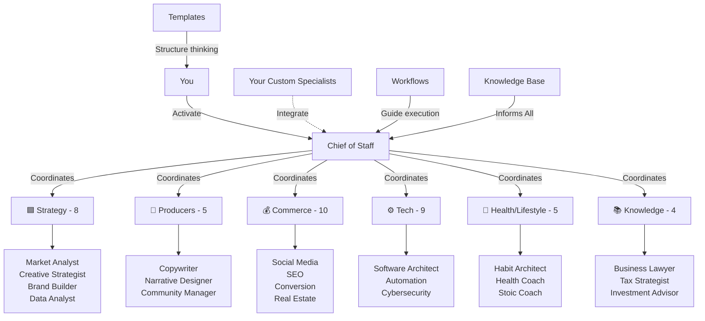

# **🏢 AI-Staff-HQ: An Extensible Framework for Your AI Workforce**

_"Why hire when you can architect?"_

Welcome to AI-Staff-HQ, a framework for building your own AI workforce. This repository provides the scaffolding and core components to create a team of specialized AI assistants tailored to your unique needs.

## **🚀 What This Is**

**AI-Staff-HQ** is my external brain—an extensible ecosystem for creating and managing my own AI workforce. It provides the core specialists, templates, and workflows I use to build a team of AI assistants that know my projects, understand my standards, and can collaborate with each other.

### **The Problem This Solves**

- ❌ Inconsistent AI responses across projects and platforms
- ❌ Having to re-explain context and requirements repeatedly
- ❌ No systematic way to leverage AI for complex, multi-faceted projects
- ❌ Knowledge scattered across multiple platforms and formats
- ❌ Lack of specialized expertise for specific business functions

### **The Solution**

- ✅ **Extensible AI Workforce** - Start with a core team of essential specialists and build your own.
- ✅ **Cross-Department Collaboration** - A framework for making your specialists work together seamlessly.
- ✅ **Systematic Knowledge Base** - A lean, universal knowledge base to build upon.
- ✅ **Example Workflows** - Proven processes that you can adapt for your own needs.
- ✅ **Core Template System** - Professional frameworks for creating new specialists and managing projects.
- ✅ **Scalable Excellence** - A system for achieving consistent, high-quality output from your AI team.

**This is cognitive infrastructure as code** - my personal AI operating system.

### Principles:
- ✅ **Infrastructure:** Optimized for context window management and systematic thinking
- ✅ **Methodology:** Patterns for moving from one-off prompts to orchestrated workflows

## **⚡ Your AI Workforce**

AI-Staff-HQ has evolved into **41 high-quality specialists** across 6 departments, organized using MtG color-coded principles. Start simple, expand as needed.

### Start Here: Core Team
These roles cover the majority of strategic, creative, and technical work:

- 🏢 [**Chief of Staff**](staff/strategy/chief-of-staff.yaml) — Project coordination, quality gates, cross-department orchestration
- 📈 [**Market Analyst**](staff/strategy/market-analyst.yaml) — Research, competitive intelligence, audience insights
- 🎨 [**Creative Strategist**](staff/strategy/creative-strategist.yaml) — Campaign strategy, creative direction
- 💰 [**Brand Builder**](staff/strategy/brand-builder.yaml) — Brand architecture, identity systems
- ✍️ [**Copywriter**](staff/producers/copywriter.yaml) — Conversion copy, messaging systems
- 📊 [**Data Analyst**](staff/strategy/data-analyst.yaml) — Analytics, experimentation, insights

> **Tip:** Start with 2-3 specialists for your first project. Expand to other departments as you discover needs.

### Full Workforce: 41 Specialists Across 6 Departments

**🟦 Strategy (8):** Creative Strategist, Brand Builder, Data Analyst, Market Analyst, Trend Forecaster, Academic Researcher, Learning Scientist
**🎨 Producers (5):** Art Director, Copywriter, Narrative Designer, Community Manager, Event Planner
**💰 Commerce (10):** Social Media Strategist, SEO Specialist, Conversion Optimizer, Customer Acquisition, Influencer Strategist, Pricing Strategist, Real Estate (4 specialists)
**⚙️ Tech (9):** Software Architect, Productivity Architect, Automation Specialist, Toolmaker, Operations Manager, Quality Control, Cybersecurity, Supply Chain, Prompt Engineer
**🌿 Health/Lifestyle (5):** Habit Architect, Cognitive Behavioral Therapist, Stoic Coach, Health Coach, Meditation Instructor
**📚 Knowledge (4):** Business Lawyer, Tax Strategist, Investment Advisor, Financial Therapist

📋 **Full Directory:** See [staff/README.md](staff/README.md) for complete specialist catalog
📊 **Implementation Status:** See [IMPLEMENTATION-STATUS.md](IMPLEMENTATION-STATUS.md) for current progress

### Build Your Own
- 📚 Copy `templates/persona/new-staff-member-template.md` into the appropriate department
- 🔍 Study existing specialists as examples of depth and structure
- 🎯 Use the Prompt Engineer to help design new specialists

## **🎯 How to Build Your AI Workforce**

### **Quick Start Pattern:**

1. **Define a Need** - What capability is missing from your team?
2. **Use the Template** - Copy `templates/persona/new-staff-member-template.md` to the `staff` directory.
3. **Flesh out the Specialist** - Use the `Prompt Engineer` to help you define the new specialist's skills, activation patterns, and quality standards.
4. **Integrate and Test** - Start using your new specialist in a simple workflow.
5. **Coordinate with the Chief of Staff** - Integrate your new specialist into larger projects.

### **Example: Creating a 'UX Designer' Specialist**

1. **Copy the template:** `cp templates/persona/new-staff-member-template.md staff/tech/ux-designer.yaml`
2. **Define the role:**
   ```yaml
   name: UX Designer
   department: Tech
   role: User Experience Designer
   skills:
     - User Research
     - Wireframing
     - Prototyping
   ```
3. **Activate your new specialist:**
   > "Act as my UX Designer. I need you to create a wireframe for a mobile app's login screen."

## **🏗️ Repository Structure**

AI-Staff-HQ/
├── 📖 README.md — Start here
├── 🎯 GETTING-STARTED.md — Choose a learning path
├── 💭 PHILOSOPHY.md — Why it's designed this way
├── ⚡ docs/QUICK-REFERENCE.md — Fast lookups (updated for 41 specialists)
├── 📊 IMPLEMENTATION-STATUS.md — Current progress and gaps
├── 👥 staff/ — 41 specialists across 6 MtG color-coded departments
│   ├── strategy/ — Blue (8 specialists)
│   ├── producers/ — Red (6 specialists + culinary subdirectory)
│   ├── commerce/ — Black (10 specialists)
│   ├── tech/ — Grey/Artifact (9 specialists)
│   ├── health-lifestyle/ — Green (5 specialists)
│   └── knowledge/ — White (4 specialists)
├── 📚 examples/ — Completed specialists, project briefs, workflows
├── 🛠️ templates/ — Persona + project templates
├── ⚡ workflows/ — System workflows and automation concepts
├── 📖 handbooks/ — Deep dives on prompt engineering & coordination
└── 🧠 knowledge-base/ — Principles, research, decisions, retrospective logs

## **🧠 The Knowledge System**

This repository is designed around **systematic knowledge management**:

- **Knowledge Cards** \- Each specialist you create represents mastery of a domain.
- **Expertise Stacking** \- Combine your custom specialists for unique capabilities.
- **Complex Project Management** \- Use the `Chief of Staff` to coordinate projects requiring multiple specialists.

## **🏗️ System Architecture**



**How It Works:**
- You activate specialists directly for single-domain tasks or route through the Chief of Staff for cross-functional coordination
- The Chief of Staff orchestrates all 6 departments: Strategy, Producers, Commerce, Tech, Health/Lifestyle, and Knowledge
- Each specialist is fully documented with capabilities, activation patterns, and workflows
- Your custom specialists integrate seamlessly using the same coordination protocols
- Templates structure thinking, workflows guide execution, and the knowledge base keeps every specialist informed

## **🚀 Getting Started Checklist**

Prefer a guided overview? Start with [`GETTING-STARTED.md`](GETTING-STARTED.md) for tailored entry paths before working through this checklist.

### **Phase 1: Your First Specialist**

- \[ \] **Read the `handbooks/ai-workflows/prompt-engineering-mastery.md` handbook.**
- \[ \] **Duplicate the `new-staff-member-template.md`** to create your first custom specialist.
- \[ \] **Use the `Prompt Engineer`** to help you flesh out your new specialist's capabilities.
- \[ \] **Test your new specialist** with a simple, single-task prompt.

### **Phase 2: Your First Team**

- \[ \] **Create a second specialist** that complements your first one.
- \[ \] **Design a simple workflow** where your two specialists collaborate. Start with a simple handoff (e.g., one specialist's output is the input for the other).
- \[ \] **Use the `Chief of Staff`** to coordinate a project involving your two new specialists.

### **Phase 3: Building Your Workforce**

- \[ \] **Create a full department** of 3-4 specialists.
- \[ \] **Adapt the `brand-development-workflow.md`** to use your custom specialists.
- \[ \] **Build a custom workflow** from scratch for a recurring task in your own work.

## **🛠️ Technical Excellence**

### **AI Platform Compatibility**

- ✅ **Universal Design**: Works with any AI that can import repositories.
- ✅ **Optimized Import**: Structured to work within typical file limits.

### **Quality Standards**

- **Modular Architecture** \- Each specialist you create works independently or collaboratively.
- **Systematic Integration** \- The framework provides clear protocols for specialist coordination.

## **🚀 Next Steps**

👉 **Start Working:** Go to [`GETTING-STARTED.md`](GETTING-STARTED.md) for the Standard Operating Procedure.

👉 **Find Help:** Keep the [**Quick Reference Guide**](docs/QUICK-REFERENCE.md) handy for activation patterns.

**🏆 I have a framework for building a complete AI workforce tailored to my needs.**

_Built with systematic thinking, designed for extensibility._ 🚀
