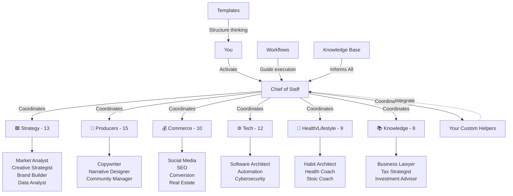

# **🏢 AI-Staff-HQ: A Toolkit for Your AI Helpers**

_"Why hire when you can build it yourself?"_

Welcome to AI-Staff-HQ! This is a toolkit to help you build your very own team of AI helpers. It gives you all the parts you need to make smart assistants that do exactly what you want.

## **🚀 What This Is**

**AI-Staff-HQ** is like my second brain. It helps me make and manage my own team of AI workers. It has templates, rules, and example workers. By using this toolkit, you can build a team of AI helpers that know your projects, follow your rules, and can even talk to each other.

### **The Problems We Solve**

- ❌ Getting different answers from different AIs.
- ❌ Having to explain the same thing over and over again.
- ❌ Not knowing how to use AI for big, hard projects.
- ❌ Having your notes scattered everywhere.
- ❌ Not having an expert when you need one.

### **Our Solutions**

- ✅ **Build Your Own Team** - Start with our main team and add your own helpers.
- ✅ **Teamwork** - Get your AI helpers to work together smoothly.
- ✅ **A Clean System** - Keep all your rules and notes in one place.
- ✅ **Example Steps** - Use our easy guides to help you get started.
- ✅ **Great Templates** - Use our safe templates to make new helpers.
- ✅ **Great Work Every Time** - Get clear, high-quality answers from your AI team.

**This is a personal AI system.** It helps your brain work better!

### Rules We Follow:

- ✅ **Smart Setup:** Designed so the AI remembers the important stuff without breaking.
- ✅ **Step-by-Step:** We show you how to move from simple questions to running big projects.

## **⚡ Your AI Team**

AI-Staff-HQ has **68 helpers** working in **7 groups** (strategy, makers, selling, tech, health, reading, and special). We recommend using the **core team of 41** every day. The other helpers are for very specific jobs.

### Start Here: The Core Team

These roles do most of the planning, making, and fixing:

- 🏢 [**Chief of Staff**](staff/strategy/chief-of-staff.yaml) — Leads the team, checks the work, and gets everyone to talk.
- 📈 [**Market Analyst**](staff/strategy/market-analyst.yaml) — Does research and learns about what people want.
- 🎨 [**Creative Strategist**](staff/strategy/creative-strategist.yaml) — Thinks of fun and big ideas.
- 💰 [**Brand Builder**](staff/strategy/brand-builder.yaml) — Builds the look and message of your brand.
- ✍️ [**Copywriter**](staff/producers/copywriter.yaml) — Writes great words to make people want to buy or read.
- 📊 [**Data Analyst**](staff/strategy/data-analyst.yaml) — Looks at the numbers and finds clues.

> **Tip:** Start with just 2 or 3 helpers for your first project. You can add more later when you need them.

### The Full Team: 68 Helpers in 7 Groups

**🟦 Strategy (13):** Chief of Staff, Market Analyst, Creative Strategist, Brand Builder, Data Analyst, Trend Forecaster, Academic Researcher, Learning Scientist, Ethicist, Alchemist, Cartographer Invisible, Etymologist Decay, Scenario Planner
**🎨 Producers (15):** Art Director, Copywriter, Narrative Designer, Community Manager, Event Planner, Beta Reader, Creative Writer, Dialect Coach, Dream Navigator, Forensic Consultant, Mirror Maker, Mythologist, Narrator, Symbolist, Translator Silence
**💰 Commerce (10):** Social Media Strategist, SEO Specialist, Conversion Optimizer, Customer Acquisition, Influencer Strategist, Pricing Strategist, Real Estate (4 specialists)
**⚙️ Tech (12):** Software Architect, Productivity Architect, Automation Specialist, Toolmaker, Operations Manager, Quality Control, Cybersecurity, Supply Chain, Prompt Engineer, Handyman, Infinite Looper, Irony Detector
**🌿 Health/Lifestyle (9):** Habit Architect, Cognitive Behavioral Therapist, Stoic Coach, Health Coach, Meditation Instructor, Active Imagination Guide, Humanist, Shadow Worker, Xenobiologist
**📚 Knowledge (8):** Business Lawyer, Tax Strategist, Investment Advisor, Financial Therapist, Antiquarian, Archivist Silence, Librarian Babel, Local Historian
**🟪 Meta (1):** Morphling (can adapt to anything)

See `staff/README.md` to see exactly what they do and how to talk to them.

📋 **Full List:** See [staff/README.md](staff/README.md) for everyone.
📊 **Past Updates:** See [archive/legacy-docs/IMPLEMENTATION-STATUS.md](archive/legacy-docs/IMPLEMENTATION-STATUS.md) for our old notes.

### Make Your Own Helper

- 📚 Copy `templates/persona/new-staff-member-template.md` into the right group folder.
- 🔍 Look at the other helpers to see how they are built.
- 🎯 Ask the Prompt Engineer helper to help you build your new helper.

## **🎯 How to Build Your Team**

### **Quick Setup:**

1. **Find a Need** - What help do you need right now?
2. **Use the Template** - Copy `templates/persona/new-staff-member-template.md` into the `staff` folder.
3. **Add the Details** - Ask the `Prompt Engineer` to help write the helper's skills and rules.
4. **Try It Out** - Start talking to your new helper with a simple question.
5. **Team Up** - Tell the Chief of Staff to bring your new helper into a big project.

## Quick Start

1.  **Install the Tools** (using `uv`):

    ```bash
    uv sync
    ```

2.  **Set Up the File**:

    ```bash
    cp .env.example .env
    # Edit the .env file to add your OPENROUTER_API_KEY
    ```

3.  **Start Chatting**:
    ```bash
    uv run tools/activate.py chief-of-staff
    ```

## How to Use It

### Chat Mode

Start a chat with any of your AI helpers:

```bash
uv run tools/activate.py <specialist-slug>
# For example:
uv run tools/activate.py creative-strategist
```

- **Chats**: Everything you say is saved to `~/.ai-staff-hq/sessions/`.
- **Come Back Later**: Type `--resume last` to pick up where you left off.
- **Stop Chatting**: Type `/exit` to close the chat.

### Fast Questions

If you just have one fast question, you don't need to open chat mode:

```bash
uv run tools/activate.py market-analyst -q "Analyze this business model..."
```

### See All Helpers

To see everyone you can talk to, type:

```bash
uv run tools/activate.py --list
```

### Testing the Code

This code uses `pytest` to make sure it works:

```bash
uv run pytest
```

### Phase 4: Making AIs Work Together (LIVE NOW)

- **The Main Tool**: All scripts starting with `dhp-` now use `bin/dhp-swarm.py` to talk to many AIs at once.
- **Doing Things at the Same Time**: Hard jobs are split into small pieces. The AIs do these pieces at the same time to save you hours.
- **Passing Notes**: You can easily pass a long note from the Market Analyst to the Brand Builder to the Copywriter.
- **Command Line View**: Test graphs using `uv run workflows/graphs/strategy_tech_handoff.py "New product idea" --auto-approve` 
- **Easy Web View**: See everything nicely by typing `uv run streamlit run ui/app.py`
- **Watch the Output**: Type `--verbose` to see exactly what is happening under the hood, or `--stream` to get live text.

## **🏗️ How the Files Are Organized**

AI-Staff-HQ/
├── 📖 README.md — Start reading here
├── 🎯 GETTING-STARTED.md — Choose how you want to learn this
├── 💭 PHILOSOPHY.md — Why we built it this way
├── ⚡ docs/QUICK-REFERENCE.md — Fast rules and cheat codes (updated for 68 helpers)
├── 📊 archive/legacy-docs/IMPLEMENTATION-STATUS.md — Old notes about what changed
├── 👥 staff/ — 68 helpers in 7 colorful groups
│ ├── strategy/ — Blue (13 planners)
│ ├── producers/ — Red (15 makers)
│ ├── commerce/ — Black (10 sellers)
│ ├── tech/ — Grey/Object (12 techies)
│ ├── health-lifestyle/ — Green (9 life helpers)
│ ├── knowledge/ — White (8 smart folks)
│ └── meta/ — Clear (1 shapeshifter)
├── 📚 examples/ — Examples of finished helpers and projects
├── 🛠️ templates/ — Empty templates for you to copy
├── ⚡ workflows/ — Step-by-step tracks to automate big jobs
├── 📖 handbooks/ — Deep lessons on how to talk to AIs
└── 🧠 knowledge-base/ — Ideas, deep thoughts, and old chat logs

Old files are kept in `archive/legacy-docs/` just in case you want to see them.

## **🧠 The Brain System**

This whole folder is built to be a **smart filing cabinet**:

- **Helper Cards** \- Every helper file holds all the expert knowledge for a single topic.
- **Stacking Smarts** \- You can combine your helpers to tackle totally unique problems.
- **Managing Big Projects** \- Use the `Chief of Staff` to keep all the helpers working nicely together.

## **🏗️ How It Connects**



**How It Works:**

- You can talk to a single helper directly or ask the Chief of Staff to talk to many helpers for you.
- The Chief of Staff talks to all 7 groups of helpers.
- Every helper has a very clear set of rules for what they can do.
- Any helpers you build will automatically slide in and listen to the Chief of Staff.
- Templates help you brainstorm. Workflows help you get work done. The knowledge base helps everybody learn.

### Choosing the Brain

- To tell the helpers which AI brain to use, we use a file called `config/model_routing.yaml`. If you don't have one here, the system will look in the folder you are working in.
- If you don't have this file, the helpers will just use the `default_model` you set up.

## **🚀 Your First Steps**

Want a step-by-step guide? Start with [`GETTING-STARTED.md`](GETTING-STARTED.md) before doing this checklist.

### **Step 1: Your First Helper**

- [ ] **Read the `handbooks/ai-workflows/prompt-engineering-mastery.md` guide.** It teaches you how to give good answers.
- [ ] **Copy the `new-staff-member-template.md`** to make your very first helper.
- [ ] **Ask the `Prompt Engineer`** helper to help you figure out what your new helper should do.
- [ ] **Test your new helper** by asking it to do a very simple job.

### **Step 2: Your First Team**

- [ ] **Make a second helper** that can do the things your first helper cannot do.
- [ ] **Make a simple plan** where your two helpers pass chores to each other. Have the first one write something and pass it to the second one to fix.
- [ ] **Tell the `Chief of Staff`** to lead a big project using your two new helpers.

### **Step 3: Building Your Office**

- [ ] **Make a full group** of 3 or 4 helpers.
- [ ] **Change the `brand-development-workflow.md`** file so it uses your special helpers.
- [ ] **Make a brand new plan** for a boring chore you do every single week. Let the helpers do the chore!

## **🛠️ High Quality Guarantee**

### **AI Tools That Work**

- ✅ **Works Anywhere**: You can use this with any AI tool that can read folders.
- ✅ **Fits Perfectly**: The files are organized so they don't break the AI's memory limits.

### **Why It's Good**

- **Blocks of Code** \- Every helper works great on their own, or in a big group.
- **Smooth Teamwork** \- The toolkit gives exact rules on how the helpers talk to each other so nothing is lost.

## **🚀 What to Do Next**

👉 **Start Working:** Open [`GETTING-STARTED.md`](GETTING-STARTED.md) to understand how to begin.

👉 **Find Help:** Keep the [**Quick Reference Guide**](docs/QUICK-REFERENCE.md) open to remind you how to talk to the helpers.

**🏆 You now have a toolkit for building an AI team that works for YOU!**

_Built with smart planning, made to grow easily._ 🚀
