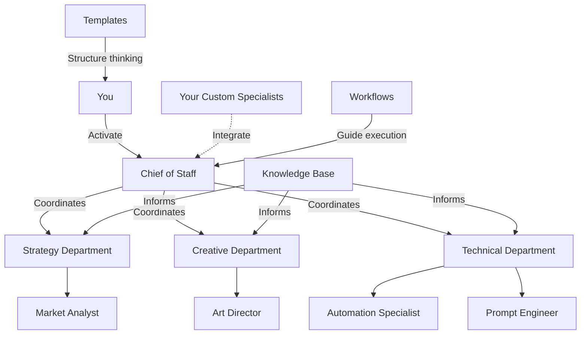

# **🏢 AI-Staff-HQ: An Extensible Framework for Your AI Workforce**

_"Why hire when you can architect?"_

Welcome to AI-Staff-HQ, a framework for building your own AI workforce. This repository provides the scaffolding and core components to create a team of specialized AI assistants tailored to your unique needs.

## **🚀 What This Is**

**AI-Staff-HQ** is not just a collection of prompts—it's an extensible ecosystem for creating and managing your own AI workforce. It provides a set of core specialists, templates, and workflows that you can use as a starting point to build a team of AI assistants that know your projects, understand your standards, and can collaborate with each other.

### **The Problem This Solves**

- ❌ Inconsistent AI responses across projects and platforms
- ❌ Having to re-explain context and requirements repeatedly
- ❌ No systematic way to leverage AI for complex, multi-faceted projects
- ❌ Knowledge scattered across multiple platforms and formats
- ❌ Lack of specialized expertise for specific business functions

### **The Solution**

- ✅ **Extensible AI Workforce** - Start with a core team of essential specialists and build your own.
- ✅ **Cross-Department Collaboration** - A framework for making your specialists work together seamlessly.
- ✅ **Systematic Knowledge Base** - A lean, universal knowledge base to build upon.
- ✅ **Example Workflows** - Proven processes that you can adapt for your own needs.
- ✅ **Core Template System** - Professional frameworks for creating new specialists and managing projects.
- ✅ **Scalable Excellence** - A system for achieving consistent, high-quality output from your AI team.

## 🎯 Understanding This Repository

**This is cognitive infrastructure as code** - my personal AI operating system, made public to share a methodology.

### What This Repo IS:
- ✅ **A paradigm demonstration:** See how to move from one-off prompts to orchestrated AI workflows
- ✅ **Personal infrastructure:** Optimized for context window management and systematic thinking
- ✅ **A starting point:** Fork it, strip what you don't need, rebuild it for your context
- ✅ **A methodology:** Learn the patterns, then create your own version

### What This Repo IS NOT:
- ❌ **Not turnkey:** Templates are thinking frameworks to fill out, not pre-made solutions
- ❌ **Not complete:** Workflows are blueprints you complete as you need them
- ❌ **Not prescriptive:** Your AI workforce should look different than mine
- ❌ **Not a product:** This is personal infrastructure shared publicly

### If You're New Here:
**Don't try to use everything.** 
1. Pick ONE specialist that matches your needs
2. Use ONE template for a real project
3. Follow ONE workflow from start to finish
4. Build from there

**The goal isn't to clone this - it's to inspire you to build your own.**

Read the design rationale in [PHILOSOPHY.md](PHILOSOPHY.md).

## **⚡ Your Core AI Workforce**

AI-Staff-HQ ships with **five essential specialists** you can activate immediately, plus a library of completed examples you can fork when you need more depth.

### The Essential 5 (Start Here)
These roles cover 80% of the work in my own operations.

- 🏢 [**Chief of Staff**](staff/strategy/chief-of-staff.yaml) — Project coordination, quality gates, retrospectives  
- 📈 [**Market Analyst**](staff/strategy/market-analyst.yaml) — Research, audience insight, competitive scans  
- 🎨 [**Art Director**](staff/creative/art-director.yaml) — Visual identity, creative direction, asset QA  
- ✍️ [**Copywriter**](examples/specialists/completed-copywriter.yaml) — Conversion copy, messaging systems, iteration loops  
- ⚡ [**Automation Specialist**](staff/technical/automation-specialist.yaml) — Workflow automation, tooling integration

> **Tip:** Activate one of the Essential 5 for your first project, then layer in additional roles as you discover gaps.

### Extend the Team (Use When Needed)
- 📊 [**Brand Strategist**](examples/specialists/completed-brand-strategist.yaml) — Positioning architecture, narrative systems  
- 📉 [**Data Analyst**](examples/specialists/completed-data-analyst.yaml) — Diagnostics, opportunity sizing, experimentation  
- 🤖 [**Prompt Engineer**](staff/technical/prompt-engineer.yaml) — Prompt design, context discipline, workflow debugging  
- 📚 Create your own specialists by copying `templates/persona/new-staff-member-template.md` into `staff/` and tailoring it to your domain.

Need a different capability (e.g., Social Media Manager, UX Researcher)? Use the template, apply the patterns in `examples/specialists/notes-on-creation.md`, and add the new role to your `staff/` directory when it earns its keep.

## **🎯 How to Build Your AI Workforce**

### **Quick Start Pattern:**

1. **Define a Need** - What capability is missing from your team?
2. **Use the Template** - Copy `templates/persona/new-staff-member-template.md` to the `staff` directory.
3. **Flesh out the Specialist** - Use the `Prompt Engineer` to help you define the new specialist's skills, activation patterns, and quality standards.
4. **Integrate and Test** - Start using your new specialist in a simple workflow.
5. **Coordinate with the Chief of Staff** - Integrate your new specialist into larger projects.

### **Example: Creating a 'UX Designer' Specialist**

1. **Copy the template:** `cp templates/persona/new-staff-member-template.md staff/technical/ux-designer.yaml`
2. **Define the role:**
   ```yaml
   name: UX Designer
   department: Technical
   role: User Experience Designer
   skills:
     - User Research
     - Wireframing
     - Prototyping
   ```
3. **Activate your new specialist:**
   > "Act as my UX Designer. I need you to create a wireframe for a mobile app's login screen."

## **🏗️ Repository Structure**

AI-Staff-HQ/
├── 👥 staff/ \# Your AI specialists, organized by department
│   ├── 🎨 creative/
│   ├── 📊 strategy/
│   └── ⚙️ technical/
├── 📖 handbooks/ \# Core principles for AI workforce management
├── 🛠️ templates/ \# Reusable frameworks for creating specialists and projects
├── ⚡ workflows/ \# Example workflows to adapt for your team
└── 🧠 knowledge-base/ \# Core principles of the system

## **🧠 The Knowledge System**

This repository is designed around **systematic knowledge management**:

- **Knowledge Cards** \- Each specialist you create represents mastery of a domain.
- **Expertise Stacking** \- Combine your custom specialists for unique capabilities.
- **Complex Project Management** \- Use the `Chief of Staff` to coordinate projects requiring multiple specialists.

## **🏗️ System Architecture**



**How It Works:**
- You activate core specialists directly or route through the Chief of Staff for multi-specialist coordination.
- The Chief of Staff orchestrates departments, ensuring Strategy, Creative, and Technical teams stay aligned.
- Your custom specialists plug into the system without friction, following the same coordination protocols.
- Templates provide structure for decisions, workflows guide execution, and the knowledge base keeps every specialist informed.

## **🚀 Getting Started Checklist**

Prefer a guided overview? Start with [`GETTING-STARTED.md`](GETTING-STARTED.md) for tailored entry paths before working through this checklist.

### **Phase 1: Your First Specialist**

- \[ \] **Read the `prompt-engineering-mastery.md` handbook.**
- \[ \] **Duplicate the `new-staff-member-template.md`** to create your first custom specialist.
- \[ \] **Use the `Prompt Engineer`** to help you flesh out your new specialist's capabilities.
- \[ \] **Test your new specialist** with a simple, single-task prompt.

### **Phase 2: Your First Team**

- \[ \] **Create a second specialist** that complements your first one.
- \[ \] **Design a simple workflow** where your two specialists collaborate. Start with a simple handoff (e.g., one specialist's output is the input for the other).
- \[ \] **Use the `Chief of Staff`** to coordinate a project involving your two new specialists.

### **Phase 3: Building Your Workforce**

- \[ \] **Create a full department** of 3-4 specialists.
- \[ \] **Adapt the `brand-development-workflow.md`** to use your custom specialists.
- \[ \] **Build a custom workflow** from scratch for a recurring task in your own work.

## **🛠️ Technical Excellence**

### **AI Platform Compatibility**

- ✅ **Universal Design**: Works with any AI that can import repositories.
- ✅ **Optimized Import**: Structured to work within typical file limits.

### **Quality Standards**

- **Modular Architecture** \- Each specialist you create works independently or collaboratively.
- **Systematic Integration** \- The framework provides clear protocols for specialist coordination.

## **🔧 Customization & Growth**

### **System Optimization**

- **Specialist Customization** \- Adapt any of the core specialists for your specific industry or needs.
- **Workflow Development** \- Create custom processes for your unique business and life challenges.

### **Community Contribution**

- **Share Your Specialists** - Contribute your custom specialists to the community.
- **Share Your Workflows** \- Contribute proven processes for complex projects.

## **🤝 Community & Support**

This is a framework for building your own AI workforce. The core components have been battle-tested in real business and personal projects.

**Questions? Optimizations? Success Stories?**

- Open an issue for bugs or documentation improvements.
- Submit pull requests for workflow enhancements.
- Share your most effective specialist combinations and project patterns.
- Review the [Contributing Guidelines](CONTRIBUTING.md) before proposing changes.
- Track major shifts in the [Version History](meta/VERSION-HISTORY.md).

## **🎯 Next Steps**

**Ready to build your AI workforce?**

👉 **Immediate Action**: Start with the [**Getting Started Checklist**](#-getting-started-checklist) to create your first specialist.

👉 **Need Onboarding Options?** Jump into [`GETTING-STARTED.md`](GETTING-STARTED.md) for role-specific paths and a condensed mastery progression.

👉 **Advanced Users**: Dive into the example [**Workflows**](workflows/) and adapt them for your custom team.

👉 **System Builders**: Explore the [**Knowledge Base**](knowledge-base/), [**Templates**](templates/), and the [**Quick Reference Guide**](docs/QUICK-REFERENCE.md) to customize the framework for maximum effectiveness. Start with the Project Brief (Simple) template for fast initiatives, and graduate to the comprehensive version when you need full multi-specialist coordination.

👉 **Launch Prep**: Read the [launch article](meta/articles/ai-staff-hq-launch.md) and reuse the shareable assets in `meta/assets/` when you introduce your fork.

**🏆 You now have a framework for building a complete AI workforce tailored to your needs. Time to start architecting!**

_Built with systematic thinking, designed for extensibility._ 🚀
