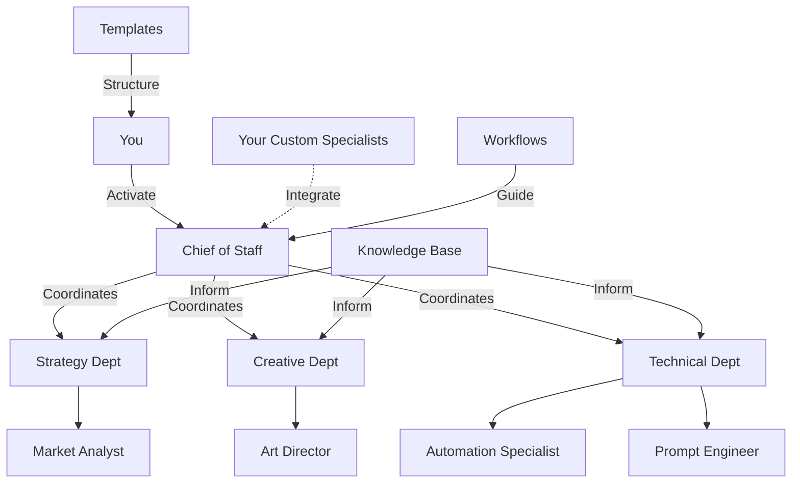

# AI-Staff-HQ Public Release Roadmap

## Priority 1: Critical Framing & Positioning (Do First)

### 1.1 Update Main README.md
**Impact:** High | **Effort:** Low | **Timeline:** 1-2 hours

Add new section immediately after the "What This Is" section:

```markdown
## 🎯 Understanding This Repository

**This is cognitive infrastructure as code** - my personal AI operating system, made public to share a methodology.

### What This Repo IS:
- ✅ **A paradigm demonstration:** See how to move from one-off prompts to orchestrated AI workflows
- ✅ **Personal infrastructure:** Optimized for context window management and systematic thinking
- ✅ **A starting point:** Fork it, strip what you don't need, rebuild it for your context
- ✅ **A methodology:** Learn the patterns, then create your own version

### What This Repo IS NOT:
- ❌ **Not turnkey:** Templates are thinking frameworks to fill out, not pre-made solutions
- ❌ **Not complete:** Workflows are blueprints you complete as you need them
- ❌ **Not prescriptive:** Your AI workforce should look different than mine
- ❌ **Not a product:** This is personal infrastructure shared publicly

### If You're New Here:
**Don't try to use everything.** 
1. Pick ONE specialist that matches your needs
2. Use ONE template for a real project
3. Follow ONE workflow from start to finish
4. Build from there

**The goal isn't to clone this - it's to inspire you to build your own.**
```

**Acceptance Criteria:**
- [x] New section added before "Your Core AI Workforce"
- [x] Sets clear expectations about personal vs. public infrastructure
- [x] Provides concrete "getting started" guidance

---

### 1.2 Create PHILOSOPHY.md
**Impact:** Medium | **Effort:** Low | **Timeline:** 2-3 hours

Create a new top-level document explaining the "why" behind design choices.

**Contents:**
- Why lean core vs. comprehensive library
- Why templates over examples
- Why YAML structure for specialists
- Why "bring your own staff" philosophy
- Context window optimization as first-class design constraint
- Personal system shared publicly vs. public product

**Acceptance Criteria:**
- [x] Created at root level
- [x] Linked from README after the new framing section
- [x] Explains design decisions that might seem "incomplete"
- [x] 500-800 words maximum

---

## Priority 2: Concrete Examples (Core Value Add)

### 2.1 Create `/examples` Directory Structure
**Impact:** High | **Effort:** Medium | **Timeline:** 1 day

```
examples/
├── README.md
├── specialists/
│   ├── completed-copywriter.yaml
│   ├── completed-brand-strategist.yaml
│   ├── completed-data-analyst.yaml
│   └── notes-on-creation.md
├── project-briefs/
│   ├── simple-blog-post-brief.md
│   ├── brand-launch-brief.md
│   └── brief-usage-notes.md
├── workflows/
│   ├── blog-post-execution-transcript.md
│   ├── brand-development-execution-transcript.md
│   └── workflow-notes.md
└── before-after/
    ├── prompt-vs-workflow-comparison.md
    └── roi-analysis.md
```

**Acceptance Criteria:**
- [x] Directory created with README explaining purpose
- [x] README states: "These are reference examples, not templates to copy"
- [x] Each subdirectory has its own explanatory README

---

### 2.2 Create 3 Completed Specialist Examples
**Impact:** High | **Effort:** Medium | **Timeline:** 4-6 hours

**Specialists to create:**
1. **Copywriter** - Most universally useful
2. **Brand Strategist** - Shows integration with core team
3. **Data Analyst** - Different domain, shows flexibility

**Each example must include:**
- Complete YAML file with all sections filled
- 3-5 real activation examples you've actually used
- Notes on why you made specific choices
- Integration notes with core specialists

**Acceptance Criteria:**
- [x] Three complete, battle-tested specialist YAMLs
- [x] Each has accompanying `notes-on-creation.md`
- [x] Demonstrates different types of specialists
- [x] Shows different levels of complexity

---

### 2.3 Create 2 Completed Project Brief Examples
**Impact:** High | **Effort:** Medium | **Timeline:** 6-8 hours

**Project briefs to create:**
1. **Simple**: Blog post creation (shows lightweight usage)
2. **Complex**: Brand launch (shows full template usage)

**Each brief must:**
- Be based on real work you've done
- Show which sections you actually used
- Include strikethroughs for sections you skipped
- Have notes explaining your decisions

**Template:**
```markdown
# Example Project Brief: [Project Name]

> **Note:** This is how I actually used the template for a real project.
> Sections I didn't need are marked with ~~strikethrough~~.

## Sections I Used:
- [x] Project Overview (essential)
- [x] Target Audience (critical for this)
- [ ] Competitive Analysis (skipped - not relevant)
...

[Then the actual filled-out brief]

---

## Retrospective Notes

**What worked:**
- Having the strategic context section forced better thinking
- The specialist assignment was clearer with this structure

**What I'd change:**
- The competitive analysis section was overkill for this
- I could have combined two sections

**Time investment:** 2 hours to fill out, saved 4 hours in execution
```

**Acceptance Criteria:**
- [x] Two real project briefs, one simple, one complex
- [x] Both show selective usage of template
- [x] Include retrospective notes on what worked
- [x] Demonstrate time/quality ROI

---

### 2.4 Create 2 Workflow Execution Transcripts
**Impact:** High | **Effort:** High | **Timeline:** 8-10 hours

**Workflows to document:**
1. **Blog post creation** (simple, linear)
2. **Brand development** (complex, multi-specialist)

**Format:**
```markdown
# Workflow Execution: [Project Name]

## Project Context
- Goal: [specific goal]
- Specialists Used: [list]
- Timeline: [actual time taken]

## Phase 1: [Phase Name]

### My Prompt to Chief of Staff:
```
[exact prompt you used]
```

### Chief of Staff Response:
[summary of response, key points]

### My Prompt to [Specialist]:
```
[exact prompt]
```

### [Specialist] Response:
[summary of output]

### My Action:
- What I did with this output
- Decisions I made
- Why I made them

[Continue for entire workflow]

## Retrospective

**What worked:**
- Specific patterns that were effective
- Specialist combinations that worked well

**What didn't:**
- Where I had to course-correct
- What I'd do differently

**Actual vs. Expected:**
- Time: [expected] vs [actual]
- Quality: [assessment]
- Would use again: Yes/No/With modifications
```

**Acceptance Criteria:**
- [x] Two complete workflow transcripts
- [x] Show real prompts and responses (summarized)
- [x] Include decision points and reasoning
- [x] Honest retrospective on effectiveness

---

### 2.5 Create Before/After Comparison
**Impact:** Medium | **Effort:** Low | **Timeline:** 2-3 hours

Show concrete value proposition.

**Document structure:**
```markdown
# The Value of Systematic AI Workflows

## Scenario: Creating a Brand Identity

### Before (One-Shot Prompting)
**Prompt:** "Create a brand identity for a coffee subscription"

**Result:** [paste actual generic result]

**Problems:**
- Generic output
- No strategic foundation
- Inconsistent quality
- Can't iterate systematically

**Time:** 15 minutes
**Quality:** 4/10
**Reusability:** None

---

### After (AI-Staff-HQ Workflow)

**Phase 1: Strategic Foundation**
- Prompt to Market Analyst: [specific prompt]
- Output: [summary of research]

**Phase 2: Brand Strategy**
- Prompt to Brand Strategist: [specific prompt]
- Output: [summary of strategy]

**Phase 3: Visual Identity**
- Prompt to Art Director: [specific prompt]
- Output: [summary of visual system]

**Result:** [paste actual structured result]

**Benefits:**
- Strategic foundation
- Consistent quality
- Systematic iteration
- Reusable patterns

**Time:** 2 hours
**Quality:** 9/10
**Reusability:** High

---

## ROI Analysis
- 8x time investment
- 2.25x quality improvement
- Infinite reusability improvement
- Process becomes faster with each use
```

**Acceptance Criteria:**
- [x] Side-by-side comparison of real outputs
- [x] Honest assessment of time/quality tradeoffs
- [x] Clear ROI analysis
- [x] Explains when this approach is overkill

---

## Priority 3: Documentation Cleanup

### 3.1 Consolidate Onboarding Documents
**Impact:** Medium | **Effort:** Medium | **Timeline:** 4-6 hours

**Current state:** HAPPY-PATH.md, R2N.md, user-manual-gemini.md overlap

**Action:** Create single `GETTING-STARTED.md`

**Structure:**
```markdown
# Getting Started with AI-Staff-HQ

## Choose Your Path

### 🚀 Quick Start (15 minutes)
For: People who learn by doing
1. Copy one core specialist
2. Use it for one task
3. Read nothing else

### 📖 Systematic Learner (1 hour)
For: People who want to understand the system
1. Read PHILOSOPHY.md
2. Review one example specialist
3. Complete one workflow

### 🏗️ Builder (2-4 hours)
For: People ready to build their own workforce
1. Fork the repository
2. Create your first custom specialist
3. Design a custom workflow

## Learning Paths by Use Case
[Links to relevant examples based on what they want to do]

## The Mastery Progression
[Condensed version of R2N.md]

## Platform-Specific Notes
[Condensed version of user-manual sections]
```

**Archive:**
- Move HAPPY-PATH.md to `/archive`
- Move R2N.md to `/archive`
- Move user-manual-gemini.md to `/archive`
- Update all links

**Acceptance Criteria:**
- [x] Single, clear onboarding document
- [x] Multiple entry points based on learning style
- [x] Links to examples for each path
- [x] Old docs archived with redirect notice

---

### 3.2 Simplify Project Brief Template
**Impact:** Medium | **Effort:** Low | **Timeline:** 2-3 hours

**Current state:** 300+ lines, overwhelming

**Action:** Create two versions

**1. `/templates/project/project-brief-simple.md`**
- 50-75 lines
- Core sections only
- For quick projects
- Links to full template

**2. `/templates/project/project-brief-comprehensive.md`**
- Current template
- Renamed for clarity
- Header explaining when to use this vs. simple

**Add to both templates:**
```markdown
## 💡 Template Usage Notes

**This template is a thinking tool, not a form to fill out.**

You don't need to complete every section. Use what serves your project:
- ✅ Delete sections that don't apply
- ✅ Add sections for your specific needs
- ✅ Treat checkboxes as thought prompts, not requirements

See `/examples/project-briefs/` for how I actually use these templates.
```

**Acceptance Criteria:**
- [x] Simple template created (50-75 lines)
- [x] Comprehensive template renamed and clarified
- [x] Usage notes added to both
- [x] README.md updated with guidance on which to use

---

### 3.3 Complete Incomplete Workflows
**Impact:** Medium | **Effort:** Medium | **Timeline:** 3-4 hours

**Files to complete:**
1. `workflows/project-types/brand-development-workflow.md` (currently stops at Phase 2)
2. `workflows/automation/content-creation-pipeline.md` (references non-existent specialists)

**Actions:**
- Complete all phases
- Update specialist references to either core team or "your custom [role]"
- Add notes: "This workflow assumes you have created [custom specialists]"
- Link to examples showing completed versions

**Acceptance Criteria:**
- [x] All workflows have complete phases
- [x] Specialist references are accurate
- [x] Assumptions clearly stated
- [ ] Links to execution examples

---

### 3.4 Create Visual System Map
**Impact:** Low | **Effort:** Medium | **Timeline:** 2-3 hours

Add Mermaid diagram to README showing system architecture.

```markdown
## 🏗️ System Architecture



**How It Works:**
1. You activate specialists directly or through Chief of Staff
2. Chief of Staff coordinates multi-specialist projects
3. Custom specialists integrate seamlessly with core team
4. Templates structure your thinking
5. Workflows guide execution
6. Knowledge Base informs all specialists
```

**Acceptance Criteria:**
- [ ] Visual diagram added to README
- [ ] Shows relationship between components
- [ ] Explains how pieces fit together

---

## Priority 4: Quality of Life Improvements

### 4.1 Add Specialist Quick Reference
**Impact:** Low | **Effort:** Low | **Timeline:** 1 hour

Create `QUICK-REFERENCE.md` at root:

```markdown
# Quick Reference Guide

## Core Specialists

### When to Use Each Specialist

**Chief of Staff**
- Use when: Project needs 2+ specialists
- Activation: "Chief of Staff, coordinate [project]"
- Best for: Complex, multi-phase projects

**Market Analyst**
- Use when: Need audience/competitor research
- Activation: "Market Analyst, research [topic]"
- Best for: Strategic foundation, data-driven decisions

**Art Director**
- Use when: Need visual strategy or brand aesthetics
- Activation: "Art Director, create [visual element]"
- Best for: Brand identity, visual systems

**Automation Specialist**
- Use when: Need to optimize repetitive tasks
- Activation: "Automation Specialist, create workflow for [task]"
- Best for: Process optimization, Python scripts

**Prompt Engineer**
- Use when: Need to optimize AI interactions
- Activation: "Prompt Engineer, improve [prompt/workflow]"
- Best for: AI workflow optimization, specialist coordination

## Common Workflows

**Solo Task:** You → Specialist → Output
**Coordinated Project:** You → Chief of Staff → Multiple Specialists → Integrated Output
**Iterative Refinement:** Specialist → Output → Your Feedback → Specialist → Improved Output

## Template Selection

| Need | Use This Template |
|------|-------------------|
| Quick project | project-brief-simple.md |
| Complex project | project-brief-comprehensive.md |
| New specialist | new-staff-member-template.md |
| Custom workflow | Copy existing workflow, adapt |
```

**Acceptance Criteria:**
- [ ] Quick reference created
- [ ] Covers most common use cases
- [ ] Linked from README
- [ ] Maximum 150 lines

---

### 4.2 Add Contributing Guidelines
**Impact:** Low | **Effort:** Low | **Timeline:** 1 hour

Create `CONTRIBUTING.md`:

```markdown
# Contributing to AI-Staff-HQ

## This is a Personal System

This repository is **my personal cognitive infrastructure**, shared publicly to demonstrate a methodology.

**I'm not looking for pull requests to expand the core system.**

## How You Can Contribute

### ✅ I Welcome:
- **Issues:** Bug reports, broken links, typos
- **Discussions:** Share how you've adapted this for your use
- **Examples:** Fork and share your version of this methodology

### ❌ I Won't Accept:
- New core specialists (this is intentionally lean)
- New templates (beyond simple bug fixes)
- Additional meta-documentation
- Feature requests that bloat the core

## Sharing Your Version

If you've built your own version of this system:
1. Fork this repo
2. Build your own specialist roster
3. Share a link in Discussions
4. Tag it with your domain/use case

I'm interested in seeing how others adapt this methodology, but this core repo stays optimized for my use case.

## Questions?

Open a Discussion (not an Issue) for:
- How to adapt this for your use case
- Design philosophy questions
- Methodology discussions
```

**Acceptance Criteria:**
- [ ] CONTRIBUTING.md created
- [ ] Sets clear expectations about PR acceptance
- [ ] Encourages adaptation over contribution
- [ ] Links to Discussions for questions

---

### 4.3 Add Changelog
**Impact:** Low | **Effort:** Low | **Timeline:** 30 minutes

Update `meta/VERSION-HISTORY.md` to be a proper changelog:

Add section at top:
```markdown
## How to Read This Changelog

This is a **personal system** that evolves continuously. Version numbers reflect major philosophical shifts, not feature releases.

**Current**: v2.0.0 - Lean framework optimized for personal use
**Previous**: v1.5.0 - Comprehensive 39-specialist system
```

**Acceptance Criteria:**
- [ ] Changelog formatted properly
- [ ] Explains versioning philosophy
- [ ] Linked from README

---

## Priority 5: Polish & Launch

### 5.1 Create Compelling Repository Description & Topics
**Impact:** Medium | **Effort:** Low | **Timeline:** 15 minutes

**Repository Description:**
```
Personal AI operating system demonstrating systematic AI workforce orchestration. Cognitive infrastructure as code - not a product, but a paradigm.
```

**Topics to add:**
- `ai-workflows`
- `prompt-engineering`
- `personal-knowledge-management`
- `ai-orchestration`
- `cognitive-infrastructure`
- `llm-workflows`
- `ai-productivity`
- `systematic-thinking`

**Acceptance Criteria:**
- [ ] Repository description updated
- [ ] Topics added
- [ ] Makes purpose immediately clear

---

### 5.2 Create Compelling Social Media Assets
**Impact:** Low | **Effort:** Medium | **Timeline:** 2-3 hours

For sharing on Twitter, LinkedIn, etc.

**Create:**
1. **One-page visual** explaining the system
2. **Before/After screenshot** showing value
3. **System diagram** (from Mermaid chart, prettified)

**Acceptance Criteria:**
- [ ] 3 shareable assets created
- [ ] Saved in `/meta/assets/`
- [ ] Sized for social media platforms

---

### 5.3 Write Launch Post / Article
**Impact:** Medium | **Effort:** High | **Timeline:** 4-6 hours

Write medium-length post (800-1200 words) explaining:
- The problem: AI prompting is ad-hoc and inconsistent
- The insight: Treat AI like a workforce, not a chatbot
- The solution: Cognitive infrastructure as code
- The caveat: This is personal infrastructure, not a product
- The invitation: Fork and build your own

**Publish on:**
- Your blog (if you have one)
- Dev.to or Medium
- LinkedIn article
- Link from README

**Acceptance Criteria:**
- [ ] Article written and published
- [ ] Linked from README
- [ ] Shared on social media

---

### 5.4 Final Pre-Launch Checklist

**Repository Quality:**
- [ ] All links work (run link checker)
- [ ] No typos in main documents (run spell check)
- [ ] Code blocks formatted correctly
- [ ] All YAML files validate
- [ ] Examples directory is complete

**Documentation Quality:**
- [ ] README has new framing section
- [ ] PHILOSOPHY.md explains design choices
- [ ] GETTING-STARTED.md consolidates onboarding
- [ ] Examples show real usage

**Expectations Management:**
- [ ] Multiple places state "this is personal infrastructure"
- [ ] CONTRIBUTING.md sets boundaries
- [ ] Examples show how to adapt, not copy
- [ ] Quick wins are easy to find

**Value Demonstration:**
- [ ] At least 3 complete specialist examples
- [ ] At least 2 project brief examples
- [ ] At least 2 workflow execution transcripts
- [ ] Before/after comparison shows ROI

---

## Timeline Summary

**Week 1: Critical Framing (10-15 hours)**
- Priority 1: Framing & positioning
- Priority 2.1: Create examples directory structure

**Week 2: Core Examples (20-25 hours)**
- Priority 2.2-2.5: Create all examples
- Highest impact work

**Week 3: Documentation Cleanup (10-15 hours)**
- Priority 3: Consolidate and complete docs
- Priority 4: Quality of life improvements

**Week 4: Polish & Launch (10-15 hours)**
- Priority 5: Final polish and launch
- Write article, create assets, share

**Total Time Investment: 50-70 hours**

---

## Post-Launch Maintenance

### Monthly:
- [ ] Review and respond to Discussions
- [ ] Fix any broken links or bugs
- [ ] Update examples if you develop new patterns

### Quarterly:
- [ ] Review and update PHILOSOPHY.md if approach changes
- [ ] Add new examples if you've developed new specialists
- [ ] Update changelog with major shifts

### When Tempted to Add:
**Ask:** Does this make the system better for me, or just more impressive to others?
- If for me: Add it
- If for others: Probably skip it

---

## Success Metrics

**You'll know this is successful when:**

1. **People fork it** and share their adapted versions
2. **Discussions are about methodology**, not "how do I use this"
3. **Issues are minimal** because expectations are clear
4. **Stars/engagement is moderate** from people who "get it"
5. **You still use it daily** because it hasn't become a maintenance burden

**Red flags:**
- Lots of PRs trying to add specialists (framing failed)
- Issues asking for hand-holding (examples insufficient)
- High stars but no forks (people collecting, not using)
- You stop using it because it became "the public version"

---

## The North Star

**Remember:** This is YOUR system, shared publicly to inspire others to build THEIR system.

Every addition should ask: "Does this help others understand my methodology without compromising my personal infrastructure?"

Keep it lean. Keep it useful. Keep it yours.
